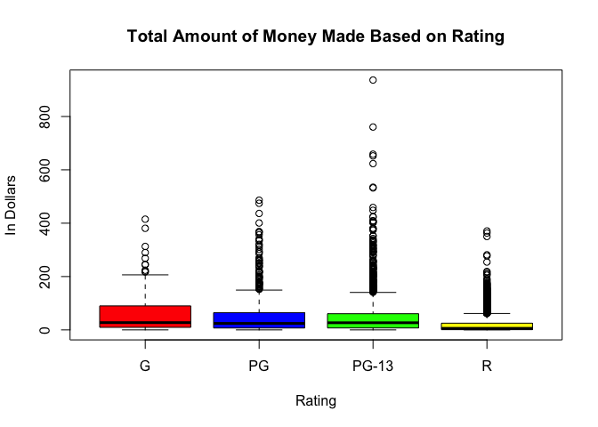

# Movies


<br />

<!-- Instructions: Come up with an interesting question and answer it with the "movies" dataset that is provided above. 

Write a Background that gives meaning to your question of interest.

State your Question.

Perform an appropriate "Analysis" that gives useful information for answering your question. The hope would be a really powerful graphic and some summary tables of supporting statistics.

Interpret your analysis and expound on your findings. -->


<!--
#[Details](https://vincentarelbundock.github.io/Rdatasets/doc/ggplot2/movies.html#) for the movies dataset.

-->
Question: Which parent guidance rating (G, PG, etc.) creates the largest amount of revenue?

Hypothesis: The rating that generates the most revenue is "R" this is because most of the movies in the 21st century are generally rated "R". Also many of the most hit movies in the past decade have been rated R. 
<br>

#Analysis

```r
movies <- read.csv('../Data/movies2.csv')
newmovies <- droplevels(subset(movies, rating %in% c('G', 'PG', 'PG-13', 'R')))

boxplot(gross/1000000 ~ rating, data = newmovies, xlab="Rating", ylab="In Dollars", main="Total Amount of Money Made Based on Rating", col=c('red', 'blue', 'green', 'yellow'))
```

<!-- -->

#Interpretation

From the graph above, we can see that the type of movies that make the most money is actually PG-13. This makes sense as PG-13 generally have the biggest target audience as anyone can come in and see a PG-13 movie while a minor has to be accompanied by an adult to see a rated R movie. Also themes are generally more family friendly so families would be more willing to bring their kids while rated R movies generally only attract adults and their older children. 

Also not only do PG-13 movies make the most on average, it also has the highest grossing movie. It also has the highest 7 grossing movies in the dataset. The highest to lowest being Star Wars: The Force Awakens at $936,662,225, Avatar at $760,507,625, Titanic at $658,672,302, Jurassic World at $652,270,625, The Avengers at $623,357,910, The Dark Knight at $534,858,444, and Rogue One at $532,177,324. All of which are PG-13. Then it's not until number 28 when you get the first rated R movie which is the Passion of Christ which makes sense as it is a historically acurate portrayal of Jesus Christ and so it attracted not only casual viewers but also deeply religious people with their families. The truly rated "R" movie based on sexual content as well as crude language and extreme violence is Deadpool which comes in at number 32 that grossed a total $363,070,709 which is less than half of the amount that Star Wars: The Force Awakens made. 

However, it is also important to look at how much is made on average based on rating as while the highest grossing movies have all been PG-13 and PG, if it makes more money on average to make a rated R movie, then more directors might be incentivized to make rated R movies as they would provide safer overall returns. 


```r
g <- subset(newmovies, rating == "G")
cat("The mean of rated G movies is:" , mean(g$gross))
```

```
## The mean of rated G movies is: 62765258
```

```r
pg <- subset(newmovies, rating == "PG")
cat("The mean of rated PG movies is:" , mean(pg$gross))
```

```
## The mean of rated PG movies is: 50104450
```

```r
pg13 <- subset(newmovies, rating == "PG-13")
cat("The mean of rated PG-13 movies is:" , mean(pg13$gross))
```

```
## The mean of rated PG-13 movies is: 51959206
```

```r
r <- subset(newmovies, rating == "R")
cat("The mean of rated R movies is:" , mean(r$gross))
```

```
## The mean of rated R movies is: 19925715
```

<br>
Surprisingly, the best movie rating that gets the most money is rated G movies which gets $62,765,258. This is really surprising because rated R movies scored the lowest on average at $19,925,715 this is 3 times as less than rated G movies! 

So if a director wants to risk it and create a movie that will be one of the highest grossing movies, then they should make a PG-13 movie. If they want to play it safe and just get high returns, they should make a G movie. 
