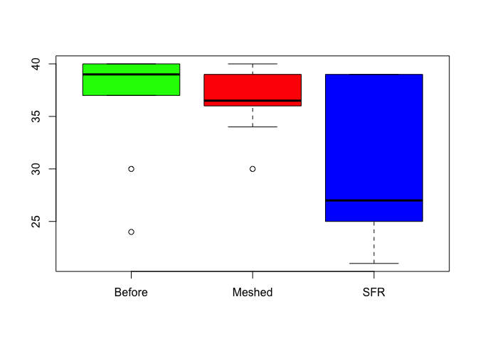

# Recalling Words

<script type="text/javascript">
 function showhide(id) {
    var e = document.getElementById(id);
    e.style.display = (e.style.display == 'block') ? 'none' : 'block';
 }
</script>


```r
# Play the chunk above and this one to get the data into your Console
View(Friendly)
?Friendly
```


<br />

#### Background

Many teachers and other educators are interested in understanding how to best deliver new content to students. In general, they have two choices of how to do this.

1. The Meshed Approach
    * Deliver new content while simultaneously reviewing previously understood content.

2. The Before Approach
    * Deliver new content after fully reviewing previously understood content.

A study was performed to determine whether the *Meshed* or *Before* approaches to delivering content had any positive benefits on memory recall. 

<div style="padding-left:15px;">

##### <a href="javascript:showhide('uniquename')">The Experiment <span style="font-size:8pt;">(click to view)</span></a>


<div id="uniquename" style="display:none;">

Individuals were seated at a computer and shown a list of words. Words appeared on the screen one at a time, for two seconds each, until all words had been shown (40 total). After all words were shown, they were required to perform a few two-digit mathematical additions (like 15 + 25) for 15 seconds to avoid immediate memory recall of the words. They were then asked to write down as many of the 40 words as they could remember. They were given a maximum of 5.3 minutes to recall words.

The process of showing words and recalling words was repeated four times with the same list of words each time (four chances to get it right). The presentation of the first trial was the same for all treatment conditions. However, trials 2, 3, and 4 were slightly different for each treatment condition.

<div style="padding-left:15px;">

The `SFR` group (the control group) stands for Standard Free Recall. In all four trials the same list of 40 words was presented, in a random order each time.

The `Before` group also used the same 40 words during each trial. However, any words that were correctly recalled in a previous trial were presented first, or *before* the words that were not recalled in the last trial. After all the correct words were presented in random order, the non-recalled words were presented in a random order.

The `Meshed` group also used the same 40 words during each trial. However, words that were correctly recalled in a previous trial were alternated with a missed word during the next presentation order. 

</div>

The data records the number of correctly recalled words (out of the 40 possible) from the fourth trial. Results were obtained for 30 students, 10 in each of the three treatment groups: `SFR`, `Before`, and `Meshed`. 

</div>

##### <a href="javascript:showhide('uniquename2')">The Data <span style="font-size:8pt;">(click to view)</span></a>

<div id="uniquename2" style="display:none;">

The results from the study can be found in the `Friendly` data set in R after loading `library(car)`. 

Click the "Code" button to see the data.


```r
datatable(Friendly, options=list(lengthMenu = c(3,10,30)))
```

<!--html_preserve--><div id="htmlwidget-ab90e12dd53781f2be49" style="width:100%;height:auto;" class="datatables html-widget"></div>
<script type="application/json" data-for="htmlwidget-ab90e12dd53781f2be49">{"x":{"filter":"none","data":[["1","2","3","4","5","6","7","8","9","10","11","12","13","14","15","16","17","18","19","20","21","22","23","24","25","26","27","28","29","30"],["SFR","SFR","SFR","SFR","SFR","SFR","SFR","SFR","SFR","SFR","Before","Before","Before","Before","Before","Before","Before","Before","Before","Before","Meshed","Meshed","Meshed","Meshed","Meshed","Meshed","Meshed","Meshed","Meshed","Meshed"],[39,25,37,25,29,39,21,39,24,25,40,38,39,37,39,24,30,39,40,40,40,39,34,37,40,36,36,38,36,30]],"container":"<table class=\"display\">\n  <thead>\n    <tr>\n      <th> <\/th>\n      <th>condition<\/th>\n      <th>correct<\/th>\n    <\/tr>\n  <\/thead>\n<\/table>","options":{"lengthMenu":[3,10,30],"columnDefs":[{"className":"dt-right","targets":2},{"orderable":false,"targets":0}],"order":[],"autoWidth":false,"orderClasses":false}},"evals":[],"jsHooks":[]}</script><!--/html_preserve-->


</div>
</div>

<br />


<!-- Begin writing your analysis below here. -->


```r
sfr <- Friendly %>%
  filter(condition == "SFR")

before <- Friendly %>%
  filter(condition == "Before")

meshed <- Friendly %>%
  filter(condition == "Meshed")

boxplot( correct ~ condition , data = Friendly, col = c("green", "red", "blue"))
```

<!-- -->

The graph above shows us the overall results of the data. We can see that the SFR group had the widest range of overall performances. It was normal to see people score as high as 37 and as low as 25. Also from the looks of the graph, it appears that the Before method looks better than the Meshed method, we want to to ultimately be sure. My hypothesis is that the Before method is actually better than the meshed, even if we had a larger sample group. 


In order to figure out which method is better (The before method or the meshed method). To do this, we need to compare our "control" group to both of the different teaching strategies. We will be using the Wilcoxon rank sum test due to the fact that we cannot prove or disprove the the data is normal due to the sample size. 


```r
wilcox.test(sfr$correct, before$correct, alternative = "less")
```

```
Warning in wilcox.test.default(sfr$correct, before$correct, alternative =
"less"): cannot compute exact p-value with ties
```

```

	Wilcoxon rank sum test with continuity correction

data:  sfr$correct and before$correct
W = 23.5, p-value = 0.02278
alternative hypothesis: true location shift is less than 0
```

```r
wilcox.test(sfr$correct, meshed$correct, alternative = "less")
```

```
Warning in wilcox.test.default(sfr$correct, meshed$correct, alternative =
"less"): cannot compute exact p-value with ties
```

```

	Wilcoxon rank sum test with continuity correction

data:  sfr$correct and meshed$correct
W = 28, p-value = 0.05075
alternative hypothesis: true location shift is less than 0
```

```r
wilcox.test(before$correct, meshed$correct, alternative = "two.sided")
```

```
Warning in wilcox.test.default(before$correct, meshed$correct, alternative
= "two.sided"): cannot compute exact p-value with ties
```

```

	Wilcoxon rank sum test with continuity correction

data:  before$correct and meshed$correct
W = 62, p-value = 0.378
alternative hypothesis: true location shift is not equal to 0
```

```r
wilcox.test(meshed$correct, before$correct, alternative = "two.sided")
```

```
Warning in wilcox.test.default(meshed$correct, before$correct, alternative
= "two.sided"): cannot compute exact p-value with ties
```

```

	Wilcoxon rank sum test with continuity correction

data:  meshed$correct and before$correct
W = 38, p-value = 0.378
alternative hypothesis: true location shift is not equal to 0
```
For the first wilcox test the P-value is 0.02278 which is low enough that we can safely conclude that the before method is statistically greater than the control group and we have to reject the null hypothesis. 

The second wilcox test, the p-value is on the edge. However, because the p-value is greater than 0.05 we have to conclude that the null hypothesis is true and that there isn't a statistical difference between the meshed method and the control group.

When comparing the two new groups together we can see that the rank of the before group is higher than the rank of the meshed group (62 to 38) so we currently believe based on the information given to us that the before group is better than the meshed group.


<!-- Note that your goal is to use the Friendly data to show whether or not the Meshed or Before methods have any positive benefit on memory recall. -->


