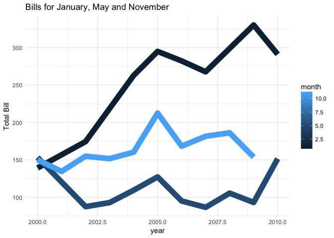

# Utilities Dataset t Test


<!-- Instructions

1. Use the Utilities dataset in R to come up with a question that can be answered with a t Test (One Sample, Paired Samples, or Independent Samples).


2. Establish why the question is interesting. State the question in written form as well as with a statistical "null" and "alternative" hypothesis.

Starter code for writing hypotheses:

$$
  H_0: \mu_\text{something} - \mu_\text{something else} = 0
$$
$$
  H_a: \mu_\text{something} - \mu_\text{something else} \neq 0
$$


3. Clearly answer your question using statistics. Be sure to compute a p-value and provide supporting numerical and graphical summaries. Also be sure to establish whether or not the requirements of your t test have been satisfied using both Q-Q Plots and references to sample size. (See the Math 325 Notebook for details.)

-->

For this analysis, we want to see if there is any true change in price for utilities based on year. My hypothesis is that there is a significant difference between the two. We will be looking at both. The test years that we will be looking at are 2000 and 2009. This is because 2000 and 2009 have the some of the largest sample populations within the entire dataset which means that it would be more likely that it would show more significant difference than the others. 


```r
one <- subset(Utilities, year == 2000)
two <- subset(Utilities, year == 2009)
newutil <- Utilities %>%
  filter(month == 1 | month == 5 | month == 11)
```


```r
newutil %>%
  ggplot(aes(x = year, y = totalbill, group = month, color = month)) +     geom_line(size = 4) + 
  theme_minimal() + 
  labs(
    x = "year",
    y = 'Total Bill',
    title = "Bills for January, May and November"
  )
```

<!-- -->

As we can see from the graph above. January shows a clear increase in price but interestingly enough, May and November don't really show too much of a difference over time. November actually looks like it is decreasing in overall cost. However a T-stat will give us a good idea if there is actually a significant difference over time. 


```r
meanone <- mean(one$totalbill)
meantwo <- mean(two$totalbill)

meandiff <- meanone - meantwo

t.test(one$totalbill, two$totalbill, mu = 0, conf.level = 0.95)
```

```
## 
## 	Welch Two Sample t-test
## 
## data:  one$totalbill and two$totalbill
## t = -1.7064, df = 19.322, p-value = 0.104
## alternative hypothesis: true difference in means is not equal to 0
## 95 percent confidence interval:
##  -100.95117   10.21617
## sample estimates:
## mean of x mean of y 
##  127.7092  173.0767
```

From the T-test shown above we can conclude that there is actually significant difference over time. As the p-value is 0.104 which is enough to reject the null hypothesis that there is no change in cost over time. 
