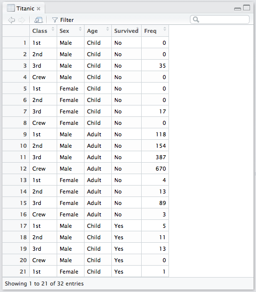
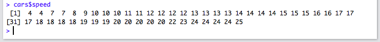
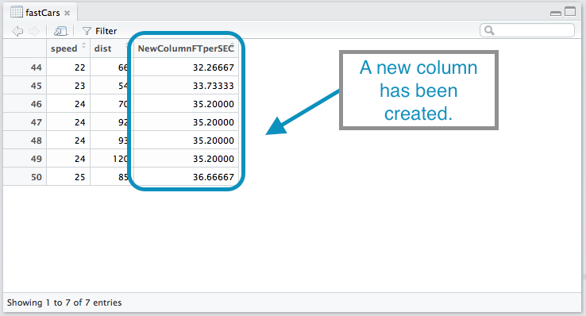
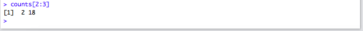
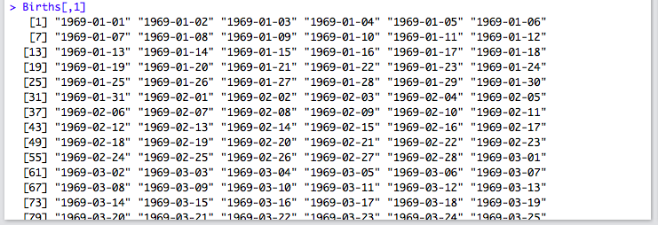

<script type="text/javascript">
 function showhide(id) {
    var e = document.getElementById(id);
    e.style.display = (e.style.display == 'block') ? 'none' : 'block';
 }
</script>


----

Add custom notes to the [My R Notes](#myRNotes) section below.


----

### data( ) {#data}

<div style="padding-left:15px;">
**Console** Help Command: `?data`

`data()`

* This command lists the available datasets in R. Information about each dataset can then be viewed using the `?nameofthedataset` command.

**Example Code**

<a href="javascript:showhide('DataOutput')">
<div class="hoverchunk">
<span class="tooltipr">
data
  <span class="tooltipRtext">An R function "data" used to bring up a list of available datasets in R.</span>
</span><span class="tooltipr">
()
  <span class="tooltipRtext">Functions always have parantheses following the function name. For this function we do not put anything inside the parantheses.</span>
</span><span class="tooltipr">
&nbsp;&nbsp;&nbsp;&nbsp;  
  <span class="tooltipRtext">Press Enter to run the code.</span>
</span><span class="tooltipr" style="float:right;">
&nbsp;...&nbsp; 
  <span class="tooltiprtext">Click to View Output.</span>
</span>
</div>
</a>
<div id="DataOutput" style="display:none;padding-left:20px;">


</div>


</div>
<br />
<hr />


### View( ) {#view}

<div style="padding-left:15px;">
**Console** Help Command: `?View`

`View(object)`

* `object` is typically the name of a `data.frame` object in R, i.e., a dataset.

**Example Code**

<a href="javascript:showhide('CarsOutput')">
<div class="hoverchunk">
<span class="tooltipr">
View(
  <span class="tooltipRtext">An R function "View" allows us to view the datset that we select. This will open up a new tab with all the data. Be sure to include the opening parantheses. </span>
</span><span class="tooltipr">
cars
  <span class="tooltipRtext">is data set that is in R. R has datasets that are available for anyone to use. It might be good to play around looking at different datasets. </span>
</span><span class="tooltipr">
)
  <span class="tooltipRtext">Always be sure to end your function with closing parantheses. </span>
</span><span class="tooltipr">
&nbsp;&nbsp;&nbsp;&nbsp;  
  <span class="tooltipRtext">Press Enter to run the code.</span>
</span><span class="tooltipr" style="float:right;">
&nbsp;...&nbsp; 
  <span class="tooltiprtext">Click to View Output.</span>
</span>
</div>
</a>
<div id="CarsOutput" style="display:none;padding-left:20px;">


</div>


<a href="javascript:showhide('TitanicOutput1')">
<div class="hoverchunk">
<span class="tooltipr">
View(
  <span class="tooltipRtext"> Function can work with datasets but also combinations and matrices that you create. </span>
</span><span class="tooltipr">
Titanic)
  <span class="tooltipRtext"> Gives us data concerning death and survival of persons on the Titanic.</span>
</span><span class="tooltipr">
&nbsp;&nbsp;&nbsp;&nbsp;  
  <span class="tooltipRtext">Press Enter to run the code.</span>
</span><span class="tooltipr" style="float:right;">
&nbsp;...&nbsp; 
  <span class="tooltiprtext">Click to View Output.</span>
</span>
</div>
</a>
<div id="TitanicOutput1" style="display:none;padding-left:20px;">



</div>
<br />
<hr />


### $ {#dollar}

<div style="padding-left:15px;">
`DataSetName$ColumnName`

* The `$` operator allows you to access the individual columns of a dataset.

**Example Code**

Thinking about putting in pictures with the `$` in use of a formula. 

</div>


<a href="javascript:showhide('ViewCars')">
<div class="hoverchunk">
<span class="tooltipr">
View(cars)
  <span class="tooltipRtext">View the cars dataset.</span>
  </span><span class="tooltipr">
&nbsp;&nbsp;&nbsp;&nbsp;  
  <span class="tooltipRtext">Press Enter to run the code.</span>
  </span><span class="tooltipr" style="float:right;">
&nbsp;...&nbsp; 
  <span class="tooltiprtext">Click to View Output.</span>
</span>
</div>
</a>

<div id="ViewCars" style="display:none;padding-left:20px;">


</div>

<a href="javascript:showhide('CarsSpeedOutput')">
<div class="hoverchunk">
<span class="tooltipr">
cars
  <span class="tooltipRtext"> Is the dataset that we want to access a column from.</span>
</span><span class="tooltipr">
$
  <span class="tooltipRtext"> Grabs the column, or variable, from the dataset to be used, this is typically used in a function but can be used in your console also. </span>
  </span><span class="tooltipr">
speed
  <span class="tooltipRtext"> Is the column that we want to access from the cars datset. </span>
</span><span class="tooltipr">
&nbsp;&nbsp;&nbsp;&nbsp;  
  <span class="tooltipRtext">Press Enter to run the code.</span>
</span><span class="tooltipr" style="float:right;">
&nbsp;...&nbsp; 
  <span class="tooltiprtext">Click to View Output.</span>
</span>
</div>
</a>  

<div id="CarsSpeedOutput" style="display:none;padding-left:20px;">



</div>


<a href="javascript:showhide('CarsDistOutput')">
<div class="hoverchunk">
<span class="tooltipr">
cars
  <span class="tooltipRtext"> Is the dataset that we want to access a column from.</span>
</span><span class="tooltipr">
$
  <span class="tooltipRtext"> Grabs the column from the dataset to be used, this is typically used in a function but can be used in your console also. </span>
  </span><span class="tooltipr">
dist
  <span class="tooltipRtext"> Is the column that we want to access from the cars dataset. </span>
</span><span class="tooltipr">
&nbsp;&nbsp;&nbsp;&nbsp;  
  <span class="tooltipRtext">Press Enter to run the code.</span>
</span><span class="tooltipr" style="float:right;">
&nbsp;...&nbsp; 
  <span class="tooltiprtext">Click to View Output.</span>
  </span><span class="tooltipr" style="float:right;">
&nbsp;...&nbsp; 
  <span class="tooltiprtext">Click to View Output.</span>
</span>
</div>
</a>  

<div id="CarsDistOutput" style="display:none;padding-left:20px;">


</div>


<br />
<hr />


### with( ) {#with}

<div style="padding-left:15px;">
**Console** Help Command: `?with`

`with(datasetName, commands)`

* This function allows you to not have to use `$` to access the columns of a dataset. It is useful sometimes, but not always.
* `datasetName` is the name of a dataset like `cars` or `CO2`.
* `commands` are any R Commands that need to be performed using the variables within the specified dataset.

**Example Code**

<a href="javascript:showhide('WithCarsMean')">
<div class="hoverchunk">
<span class="tooltipr">
with(
  <span class="tooltipRtext">The R function "with" says that any command after this will be used using the selected dataset. </span>
</span><span class="tooltipr">
cars,
  <span class="tooltipRtext">Immediatly after the opening paratheses we state the datset that we want our commands to use. </span>
  </span><span class="tooltipr">
&nbsp;mean(
  <span class="tooltipRtext"> Is the command that we want to use with our dataset. It doesn't necessarily have to be "mean" but can be a wide range of commands. </span>
</span><span class="tooltipr">
dist))
  <span class="tooltipRtext"> Is the variable from our dataset that we want our command to use. It is closed off with closing parantheses. </span>
</span><span class="tooltipr">
&nbsp;&nbsp;&nbsp;&nbsp;  
  <span class="tooltipRtext">Press Enter to run the code.</span>
  </span><span class="tooltipr" style="float:right;">
&nbsp;...&nbsp; 
  <span class="tooltiprtext">Click to View Output.</span>
  
</span>
</div>
</a> 
  
  <div id="WithCarsMean" style="display:none;padding-left:20px;">
  
  
```{r, echo=FALSE}
with(mtcars, mean(dist))
```

</div>

<a href="javascript:showhide('WithCarsCor')">
<div class="hoverchunk">
<span class="tooltipr">
with(cars, 
  <span class="tooltipRtext">This was explained in the first example.</span>
</span><span class="tooltipr">
&nbsp;cor( 
  <span class="tooltipRtext"> Gives us the correlation coefficient. As previously stated, it doesn't have to be correlation command.  </span>
  </span><span class="tooltipr">
dist, 
  <span class="tooltipRtext"> Is the first variable from the cars dataset to be used for the correlation command. </span>
</span><span class="tooltipr">
&nbsp;speed))
  <span class="tooltipRtext"> Is the second variable from the cars dataset to be used for the correlation command. It is closed off with closing parantheses. </span>
</span><span class="tooltipr">
&nbsp;&nbsp;&nbsp;&nbsp;  
  <span class="tooltipRtext">Press Enter to run the code.</span>
  </span><span class="tooltipr" style="float:right;">
&nbsp;...&nbsp; 
  <span class="tooltiprtext">Click to View Output.</span>
  
</span>
</div>
</a> 
  
  <div id="WithCarsCor" style="display:none;padding-left:20px;">
  
```{r, echo=FALSE}
#with(mtcars,cor(dist,speed))
```

</div>

</div>
<br />
<hr />

### <- {#assignment}

<div style="padding-left:15px;">
**Console** Help Command: `none`

`NameYouCreate <- some R commands`

* `<-` (Less than symbol `<` with a hyphen `-`) is called the assignment operator and lets you store the results of the `some R commands` into an object called `NameYouCreate`.
* `NameYouCreate` is any name that begins with a letter, but can use numbers, periods, and underscores thereafter. The name should not contain spaces. 

**Example Code**

<a href="javascript:showhide('NamingCars1')">
<div class="hoverchunk">
<span class="tooltipr">
aveSpeed
  <span class="tooltipRtext">First we name the object we are creating, perhaps we are naming a formula, a value, or a subset. </span>
 </span><span class="tooltipr">
&nbsp; <- 
  <span class="tooltipRtext"> Is the function that allows what follows to be assigned to the object we just created. </span>
  </span><span class="tooltipr">
&nbsp;mean(
  <span class="tooltipRtext">In this case, we are using a command and the value is what will be put into the aveSpeed object. </span>
 </span><span class="tooltipr">
mtcars`$`speed)
  <span class="tooltipRtext"> Is the variable we are finding the mean of, notice we used `$` instead of "with". </span>
 </span><span class="tooltipr">
&nbsp;&nbsp;&nbsp;&nbsp;  
  <span class="tooltipRtext">Press Enter to run the code.</span>
  
  
  </span><span class="tooltipr">
  aveSpeed
  <span class="tooltipRtext">Run this in your console to find the value of the mean of speed. This can be useful in creating shortcuts that require the mean instead of writing the mean formula out. </span>
</span><span class="tooltipr" style="float:right;">
&nbsp;...&nbsp; 
  <span class="tooltiprtext">Click to View Output.</span>
</span>
</div>
</a>  

<div id="NamingCars1" style="display:none;padding-left:20px;">

  
  </div>
  
  <a href="javascript:showhide('NamingCars2')">
<div class="hoverchunk">
<span class="tooltipr">
fastCars
  <span class="tooltipRtext"> Is the name we are giving to the new object we are creating. Make sure it has no spaces. </span>
 </span><span class="tooltipr">
&nbsp; <- 
  <span class="tooltipRtext"> Is the function that allows for what follows to be assigned to the object we just stated. </span>
  </span><span class="tooltipr">
&nbsp;subset(cars,
  <span class="tooltipRtext">In this case, we are using a function that filters the datset cars. You will learn more about the function subset further down. </span>
 </span><span class="tooltipr">
&nbsp;speed > 20)
  <span class="tooltipRtext">We are filtering our datset so that only cars with a speed greater than 20 mph. </span>
 </span><span class="tooltipr">
&nbsp;&nbsp;&nbsp;&nbsp;  
  <span class="tooltipRtext">Press Enter to run the code.</span>
  
  
  </span><span class="tooltipr">
View(cars)
  <span class="tooltipRtext">View the original cars datset, pay attention to the values in the speed variable. </span>
  
  </span><span class="tooltipr">
View(fastCars)
  <span class="tooltipRtext">Now if you look at the datset fastCars, that we just made, it will only include speed values greater than 20mph.</span>
  </span><span class="tooltipr" style="float:right;">
&nbsp;...&nbsp; 
  <span class="tooltiprtext">Click to View Output.</span>
</span>
</div>
</a>  

<div id="NamingCars2" style="display:none;padding-left:20px;">

  
    
</span>
</div>
</a> 


  <a href="javascript:showhide('NewColumnCars')">
<div class="hoverchunk">
<span class="tooltipr">
fastCars`$`NewColumnFTPerSec 
  <span class="tooltipRtext"> Allows us to create a new column in the dataset fastCars, this is because of the use of the `$`. The name of the new column is what follows the `$`.  </span>
 </span><span class="tooltipr">
&nbsp; <- 
  <span class="tooltipRtext"> Is the function that allows for what follows to be assigned to the column we just stated. </span>
  </span><span class="tooltipr">
&nbsp;fastCars$speed 
  <span class="tooltipRtext">We are creating a new column using the data found in the speed variable.  </span>
 </span><span class="tooltipr">
&nbsp; * 5280 / 3600 
  <span class="tooltipRtext"> How we are manipulating the speed variable to create the new column, it will have speed multiplied by 5280 feet and then divided by 3600 seconds.  </span>
 </span><span class="tooltipr">
&nbsp;&nbsp;&nbsp;&nbsp;  
  <span class="tooltipRtext">Press Enter to run the code.</span>
  
  
  </span><span class="tooltipr">
View(fastCars)
  <span class="tooltipRtext">Now if you look at the datset fastCars, it will have the new column "NewColumnFTperSEC". </span>
  </span><span class="tooltipr" style="float:right;">
&nbsp;...&nbsp; 
  <span class="tooltiprtext">Click to View Output.</span>
  
  
</span>
</div>
</a> 
  
<div id="NewColumnCars" style="display:none;padding-left:20px;">



</div>
<br />
<hr />

### c( ) {#cvector}

<div style="padding-left:15px;">
**Console** Help Command: `?c`

`c( )`

* The `c( )` function combines values into a vector or list.

**Example Code**


  <a href="javascript:showhide('ConsoleExample')">
<div class="hoverchunk">
 </span><span class="tooltipr">
## Run these commands in your console to see how they work. 
  <span class="tooltipRtext"></span>


<span class="tooltipr">
c(
  <span class="tooltipRtext">The R function "c()" allows us to group together values, they can then be used in formulas, matricies, datasets, and in many more ways. </span>
 </span><span class="tooltipr">
4
  <span class="tooltipRtext"> Are the values that are being grouped together, they can be numeric or categorical. </span>
  </span><span class="tooltipr">
,
  <span class="tooltipRtext"> Seperates the values that are being grouped, values can be quantitive or qualitative. </span>
  </span><span class="tooltipr">
10,40
  <span class="tooltipRtext"> Are the rest of the values being grouped together. </span>
  </span><span class="tooltipr">
) 
  <span class="tooltipRtext">Always close off your function with closing paratheses.</span>
 </span><span class="tooltipr">
&nbsp;&nbsp;&nbsp;&nbsp;  
  <span class="tooltipRtext">Press Enter to run the code.</span>
  
  
  </span><span class="tooltipr">
c(1
  <span class="tooltipRtext">This was explained in the example above. The "1" is the starting value.</span>
    </span><span class="tooltipr">
:
  <span class="tooltipRtext"> Groups all the numbers between two numbers. </span>
  </span><span class="tooltipr">
5)
  <span class="tooltipRtext"> Is the ending value. End your function with closing parantheses. </span>
 </span><span class="tooltipr">
&nbsp;&nbsp;&nbsp;&nbsp;  
  <span class="tooltipRtext">Press Enter to run the code.</span>
  
  
  </span><span class="tooltipr">
c(
  <span class="tooltipRtext">This was explained in the first example. </span>
    </span><span class="tooltipr">
"dog","cat","bird")
  <span class="tooltipRtext"> Are qualitative values that can also be grouped, be sure to include the quotations around the values and commas to separate the qualitative values. </span>
 </span><span class="tooltipr">
&nbsp;&nbsp;&nbsp;&nbsp;  
  <span class="tooltipRtext">Press Enter to run the code.</span>
  

</span>
</div>
</a> 

<a href="javascript:showhide('ConsoleExample2')">
<div class="hoverchunk">
<span class="tooltipr">
Classlist <- 
  <span class="tooltipRtext">This is the naming function that was discussed above the "c()" function. </span>
 </span><span class="tooltipr">
&nbsp;c(
  <span class="tooltipRtext">In this case, we are grouping values into a object named "Classlist".  </span>
  </span><span class="tooltipr">
"Jackson","Jared","Jill","Jane")
  <span class="tooltipRtext"> Are the values we are grouping into the name "Classlist".  </span>
 </span><span class="tooltipr">
&nbsp;&nbsp;&nbsp;&nbsp;  
  <span class="tooltipRtext">Press Enter to run the code.</span>
  
  
  </span><span class="tooltipr">
Classlist
  <span class="tooltipRtext">Run "Classlist" in your console to see the values. </span>
 </span><span class="tooltipr">
&nbsp;&nbsp;&nbsp;&nbsp;  
 <span class="tooltipRtext">Press Enter to run the code.</span>
 </span><span class="tooltipr" style="float:right;">
&nbsp;...&nbsp; 
  <span class="tooltiprtext">Click to View Output.</span>
  
</span>
</div>
</a> 

<div id="ConsoleExample2" style="display:none;padding-left:20px;">


</div>

<a href="javascript:showhide('ConsoleExample3')">
<div class="hoverchunk">
<span class="tooltipr">
steps <- 
  <span class="tooltipRtext">This is the naming function that was discussed above the "c()" function. </span>
 </span><span class="tooltipr">
&nbsp;c(
  <span class="tooltipRtext">In this case, we are grouping values into a object named "steps".  </span>
  </span><span class="tooltipr">
10000,7000,6000,11000)
  <span class="tooltipRtext"> Are the values we are grouping into the name "steps".  </span>
 </span><span class="tooltipr">
&nbsp;&nbsp;&nbsp;&nbsp;  
  <span class="tooltipRtext">Press Enter to run the code.</span>
  
  
  </span><span class="tooltipr">
steps
  <span class="tooltipRtext">Run "steps" in your console to see the values. </span>
 </span><span class="tooltipr">
&nbsp;&nbsp;&nbsp;&nbsp;  
  <span class="tooltipRtext">Press Enter to run the code.</span>
  </span><span class="tooltipr" style="float:right;">
&nbsp;...&nbsp; 
  <span class="tooltiprtext">Click to View Output.</span>
  
  
  
  <div id="ConsoleExample3" style="display:none;padding-left:20px;">

  
</span>
</div>
</a> 
  
</div>
<br />
<hr />

### subset( ) {#subset}

<div style="padding-left:15px;">
**Console** Help Command: `?subset`

`subset(NameOfDataset, condition)`

* `NameOfDataset` is the name of a dataset, like `mtcars` or `CO2`.
* `condition` is some logical expression that uses any of the following logical connectors.

<div style="padding-left:30px;">
| **Logical Expression** | **Syntax** | 
|--------------------|--------|
| Equals | `==` |
| Not Equal | `!=` |
| Less Than | `<` |
| Less Then or Equal to | `<=` |
| Greater Than | `>` |
| Greater Than or Equal to | `>=` |
| AND | `&` | 
| OR | `|` |
| IN | `%in%` |
| NOT | `!` |
</div>

**Example Code**


<a href="javascript:showhide('View')">
<div class="hoverchunk">
<span class="tooltipr">
View(KidsFeet)
  <span class="tooltipRtext">Look at the section "View" above to understand first.
  </span><span class="tooltipr">
&nbsp;&nbsp;&nbsp;&nbsp;  
  <span class="tooltipRtext">Press Enter to run the code.</span></span>
</span>
</div>
</a>

<a href="javascript:showhide('SubsetEqual')">
<div class="hoverchunk">
<span class="tooltipr">
subset(
  <span class="tooltipRtext">An R function "subset" allows us to take our data and filter it with certain criteria. </span>
</span><span class="tooltipr">
KidsFeet,
  <span class="tooltipRtext"> Is the data we are filtering, in this case it is the data set "KidsFeet". The comma seperates the criteria. </span>
</span><span class="tooltipr">
&nbsp;birthyear
  <span class="tooltipRtext"> Represents the variable that we want to manipulate, it can be qualitative or quantitative. The variable "birthyear" reperesents the year the child was born in. </span>
</span><span class="tooltipr">
&nbsp;==
  <span class="tooltipRtext"> Represents "Equals To". The reason for the double equal sign will be explained later on.  </span>
  </span><span class="tooltipr">
&nbsp;88)
  <span class="tooltipRtext">  Is the criteria from the variable that we want. In this case it represents kids born in 1988. This can be qualitative or quantitive.</span>
</span><span class="tooltipr">
&nbsp;&nbsp;&nbsp;&nbsp;  
  <span class="tooltipRtext">Press Enter to run the code.</span>
</span><span class="tooltipr" style="float:right;">
&nbsp;...&nbsp; 
  <span class="tooltiprtext">Click to View Output.</span>
</span>
</div>
</a>
<div id="SubsetEqual" style="display:none;padding-left:20px;">

</div>

<a href="javascript:showhide('SubsetNotEqual')">
<div class="hoverchunk">
<span class="tooltipr">
subset(
  <span class="tooltipRtext">An R function "subset" allows us to take our data and filter it with certain criteria. </span>
</span><span class="tooltipr">
KidsFeet,
  <span class="tooltipRtext">This part was explained in the first example </span>
</span><span class="tooltipr">
&nbsp;name
  <span class="tooltipRtext">Look at the first example. The variable "name" represents the names from which the data was collected.  </span>
</span><span class="tooltipr">
!
  <span class="tooltipRtext"> Represents not. It is saying everything but the criteria you give it. This can be a valuable symbol when dealing with outliers. </span>
</span><span class="tooltipr">
=
  <span class="tooltipRtext"> Represents equal, together with the "!", we are saying not equal. Notice again in the first example we had two equal signs, now you can see how having two allows for greater manipulation.  </span>
  </span><span class="tooltipr">
"
  <span class="tooltipRtext"> Are needed because the value is qualitative. </span>
</span><span class="tooltipr">
Josh")
  <span class="tooltipRtext"> Is the criteria from the variable that we do not want to include. In this case it is anyone named Josh. It is closed with ending quotations and closing paratheses. </span>
</span><span class="tooltipr">
&nbsp;&nbsp;&nbsp;&nbsp;  
  <span class="tooltipRtext">Press Enter to run the code.</span>
</span><span class="tooltipr" style="float:right;">
&nbsp;...&nbsp; 
  <span class="tooltiprtext">Click to View Output.</span>
</span>
</div>
</a>

<div id="SubsetNotEqual" style="display:none;padding-left:20px;">


</div>

<a href="javascript:showhide('LessThan')">
<div class="hoverchunk">
<span class="tooltipr">
subset(KidsFeet,
  <span class="tooltipRtext">This was explained in the first example. </span>
</span><span class="tooltipr">
&nbsp;length
  <span class="tooltipRtext"> Variable represents the length of the bigger size foot from each child. </span>
</span><span class="tooltipr">
&nbsp;<
  <span class="tooltipRtext"> Represents "Less Than" certain value. For this to work, the value must be quantitative. </span>
  </span><span class="tooltipr">
 &nbsp;24)
  <span class="tooltipRtext"> Is the quantitative value that we want less than of. In this case we want all children with foot length of less than 24cm.  </span>
</span><span class="tooltipr">
&nbsp;&nbsp;&nbsp;&nbsp;  
  <span class="tooltipRtext">Press Enter to run the code.</span>
</span><span class="tooltipr" style="float:right;">
&nbsp;...&nbsp; 
  <span class="tooltiprtext">Click to View Output.</span>
</span>
</div>
</a>

<div id="LessThan" style="display:none;padding-left:20px;">


</div>

<a href="javascript:showhide('LessThanorEqualTo')">
<div class="hoverchunk">
<span class="tooltipr">
subset(KidsFeet,
  <span class="tooltipRtext">This was explained in the first example. </span>
</span><span class="tooltipr">
&nbsp;length
  <span class="tooltipRtext"> Variable represents the length of the bigger size foot from each child. </span>
</span><span class="tooltipr">
&nbsp;<=
  <span class="tooltipRtext"> Represents "Less Than or Equal to" certain value. For this to work, the value must be quantitative. </span>
  </span><span class="tooltipr">
 &nbsp;24)
  <span class="tooltipRtext"> Is the quantitative value that we want our data to be equal to and less than. In this case we want all children with foot length of 24cm and below.  </span>
</span><span class="tooltipr">
&nbsp;&nbsp;&nbsp;&nbsp;  
  <span class="tooltipRtext">Press Enter to run the code.</span>
</span><span class="tooltipr" style="float:right;">
&nbsp;...&nbsp; 
  <span class="tooltiprtext">Click to View Output.</span>
</span>
</div>
</a>

<div id="LessThanorEqualTo" style="display:none;padding-left:20px;">


</div>

<a href="javascript:showhide('GreaterThan')">
<div class="hoverchunk">
<span class="tooltipr">
subset(KidsFeet,
  <span class="tooltipRtext">This was explained in the first example. </span>
</span><span class="tooltipr">
&nbsp;width
  <span class="tooltipRtext"> Variable represents the width of the wider foot from each child. </span>
</span><span class="tooltipr">
&nbsp;>
  <span class="tooltipRtext"> Represents "Greater Than" certain value. For this to work, the value must be quantitative. </span>
  </span><span class="tooltipr">
 &nbsp;9)
  <span class="tooltipRtext"> Is the quantitative value that we want our data to be greater than. In this case we want all children with foot width greater than 9cm. </span>
</span><span class="tooltipr">
&nbsp;&nbsp;&nbsp;&nbsp;  
  <span class="tooltipRtext">Press Enter to run the code.</span>
</span><span class="tooltipr" style="float:right;">
&nbsp;...&nbsp; 
  <span class="tooltiprtext">Click to View Output.</span>
</span>
</div>
</a>

<div id="GreaterThan" style="display:none;padding-left:20px;">


</div>

<a href="javascript:showhide('GreaterThanorEqualTo')">
<div class="hoverchunk">
<span class="tooltipr">
subset(KidsFeet,
  <span class="tooltipRtext">This was explained in the first example. </span>
</span><span class="tooltipr">
&nbsp;width
  <span class="tooltipRtext"> Variable represents the width of the wider foot from each child. </span>
</span><span class="tooltipr">
&nbsp;>=
  <span class="tooltipRtext">  Represents "Greater Than or Equal To" certain value. For this to work, the value must be quantitative. </span>
  </span><span class="tooltipr">
 &nbsp;9)
  <span class="tooltipRtext">Is the quantitative value that we want our data to be greater than and equal to, in this case we want all children with foot width 9cm and above. </span>
</span><span class="tooltipr">
&nbsp;&nbsp;&nbsp;&nbsp;  
  <span class="tooltipRtext">Press Enter to run the code.</span>
</span><span class="tooltipr" style="float:right;">
&nbsp;...&nbsp; 
  <span class="tooltiprtext">Click to View Output.</span>
</span>
</div>
</a>

<div id="GreaterThanorEqualTo" style="display:none;padding-left:20px;">


</div>

<a href="javascript:showhide('And')">
<div class="hoverchunk">
<span class="tooltipr">
subset(KidsFeet,
  <span class="tooltipRtext">This was explained in the first example. </span>
</span><span class="tooltipr">
&nbsp;sex=="G"
  <span class="tooltipRtext"> Variable "sex" represents the first criteria. We only want girls, represented by "G", so we write "==". </span>
</span><span class="tooltipr">
&nbsp;&
  <span class="tooltipRtext"> Represents the logic statement "And". It is used when you want to subset from two or more seperate variables. It can be used with qualitative and quantitative data. In this case, we are specifying girls that have foot width greater than 9cm.  </span>
  </span><span class="tooltipr">
 &nbsp;width > 9)
  <span class="tooltipRtext"> Represents the second criteria. We want any foot width that is greater than 9. </span>
</span><span class="tooltipr">
&nbsp;&nbsp;&nbsp;&nbsp;  
  <span class="tooltipRtext">Press Enter to run the code.</span>
</span><span class="tooltipr" style="float:right;">
&nbsp;...&nbsp; 
  <span class="tooltiprtext">Click to View Output.</span>
</span>
</div>
</a>

<div id="And" style="display:none;padding-left:20px;">


</div>

<a href="javascript:showhide('Or')">
<div class="hoverchunk">
<span class="tooltipr">
subset(KidsFeet,
  <span class="tooltipRtext">This was explained in the first example. </span>
</span><span class="tooltipr">
&nbsp;birthmonth == 1
  <span class="tooltipRtext"> Variable "birthmonth" represents the first criteria. We want to look at children born in January. </span>
</span><span class="tooltipr">
&nbsp;|
  <span class="tooltipRtext"> Represents the logic statement "Or". It is used when you want to subset two or more criteria from the same variable. It can be used with qualitative or quantitative data. In this case, we are specifying we want children born in January or June. </span>
  </span><span class="tooltipr">
 &nbsp;birthmonth == 6)
  <span class="tooltipRtext"> Is the second criteria. We want to look at children that are born in June. </span>
</span><span class="tooltipr">
&nbsp;&nbsp;&nbsp;&nbsp;  
  <span class="tooltipRtext">Press Enter to run the code.</span>
</span><span class="tooltipr" style="float:right;">
&nbsp;...&nbsp; 
  <span class="tooltiprtext">Click to View Output.</span>
</span>
</div>
</a>

<div id="Or" style="display:none;padding-left:20px;">


</div>

<a href="javascript:showhide('IN')">
<div class="hoverchunk">
<span class="tooltipr">
subset(KidsFeet,
  <span class="tooltipRtext">This was explained in the first example. </span>
</span><span class="tooltipr">
&nbsp;width
  <span class="tooltipRtext"> Represents the width of the widest foot of the child. When using the logic statement "In", the variable comes first. </span>
</span><span class="tooltipr">
&nbsp;%in$
  <span class="tooltipRtext"> Allows for specific values to be subsetted. The values can be qualitative or quantitative. </span>
  </span><span class="tooltipr">
 &nbsp;c(
  <span class="tooltipRtext">Recall that the "c()" command allows us to select certain values and combine them into a set or a group. In this case we select them to be subsetted.  </span>
</span><span class="tooltipr">
8.3,8.5,9.0,9.5))
  <span class="tooltipRtext"> Are the values that we are selecting, they will always be in list form, seperating each value by a comma. The entire function is closed with closing paratheses. </span>
</span><span class="tooltipr">
&nbsp;&nbsp;&nbsp;&nbsp;  
  <span class="tooltipRtext">Press Enter to run the code.</span>
</span><span class="tooltipr" style="float:right;">
&nbsp;...&nbsp; 
  <span class="tooltiprtext">Click to View Output.</span>
</span>
</div>
</a>

<div id="IN" style="display:none;padding-left:20px;">


</div>


</div>
<br />
<hr />


### [ ] {#brackets}

<div style="padding-left:15px;">
**Console** Help Command: `none`

`objectName[ elementNumber ]`

`objectName[ Rows, Columns]` 

* If `objectName` is an object that contains a list of numbers then `[ elementNumber ]` will pull out the specified elements.
* If `objectName` is an object with rows and columns (like a dataset) then the specified `[ Rows , Columns]` can be accessed.

**Example Code**


  <a href="javascript:showhide('ElementExample')">
<div class="hoverchunk">
 </span><span class="tooltipr">
## Run these commands in your console to see how they work. 
  <span class="tooltipRtext"></span>
  

<span class="tooltipr">
counts <- c(5, 2, 18)
  <span class="tooltipRtext">Run this command in your console</span>
  </span><span class="tooltipr">
&nbsp;&nbsp;&nbsp;&nbsp;  
  <span class="tooltipRtext">Press Enter to run the code.</span>
  
  
 </span><span class="tooltipr">
 counts
  <span class="tooltipRtext">Run this command in your console to see the values.  </span>
  </span><span class="tooltipr">
&nbsp;&nbsp;&nbsp;&nbsp;  
  <span class="tooltipRtext">Press Enter to run the code.</span>
  </span><span class="tooltipr" style="float:right;">
&nbsp;...&nbsp; 
  <span class="tooltiprtext">Click to View Output.</span>
  
  
</span>
</div>
</a> 
  
<div id="ElementExample" style="display:none;padding-left:20px;">


</div>
  
  
<a href="javascript:showhide('ElementExample1')">
<div class="hoverchunk">
  </span><span class="tooltipr">
counts
  <span class="tooltipRtext">First, state the object that will be accessed. </span>
    </span><span class="tooltipr">
[
  <span class="tooltipRtext">Opening brackets to allow for the command to be started. </span>
  </span><span class="tooltipr">
2
  <span class="tooltipRtext"> Is the element number because it is a list of numbers. </span>
  </span><span class="tooltipr">
]
  <span class="tooltipRtext">Closing brackets allow for the command to end. </span>
 </span><span class="tooltipr">
&nbsp;&nbsp;&nbsp;&nbsp;  
  <span class="tooltipRtext">Press Enter to run the code.</span>
  </span><span class="tooltipr" style="float:right;">
&nbsp;...&nbsp; 
  <span class="tooltiprtext">Click to View Output.</span>
  
</span>
</div>
</a> 
  
<div id="ElementExample1" style="display:none;padding-left:20px;">

  
  
 </div> 
  
  <a href="javascript:showhide('ElementExample2')">
<div class="hoverchunk">
  </span><span class="tooltipr">
counts[
  <span class="tooltipRtext">This was explained in the first example. </span>
    </span><span class="tooltipr">
2:3]
  <span class="tooltipRtext">Represents between. In this case, we want element numbers 2 and 3. </span>
 </span><span class="tooltipr">
&nbsp;&nbsp;&nbsp;&nbsp;  
  <span class="tooltipRtext">Press Enter to run the code.</span>
  </span><span class="tooltipr" style="float:right;">
&nbsp;...&nbsp; 
  <span class="tooltiprtext">Click to View Output.</span>
  
</span>
</div>
</a>
  
  
<div id="ElementExample2" style="display:none;padding-left:20px;">
  
  
  
  
  
</div>

<a href="javascript:showhide('ElementExample3')">
<div class="hoverchunk">
  </span><span class="tooltipr">
counts[
  <span class="tooltipRtext">This was explained in the first example. </span>
    </span><span class="tooltipr">
c(
  <span class="tooltipRtext">Recall that the "c()" function groups together values.  </span>
  </span><span class="tooltipr">
1,3
  <span class="tooltipRtext"> Represents the specific element numbers. </span>
  </span><span class="tooltipr">
)]
  <span class="tooltipRtext">Be sure to close off with the needed parantheses and brackets. </span>
 </span><span class="tooltipr">
&nbsp;&nbsp;&nbsp;&nbsp;  
  <span class="tooltipRtext">Press Enter to run the code.</span>
  </span><span class="tooltipr" style="float:right;">
&nbsp;...&nbsp; 
  <span class="tooltiprtext">Click to View Output.</span>
  
</span>
</div>
</a>
  
<div id="ElementExample3" style="display:none;padding-left:20px;">

  
</div>


  <a href="javascript:showhide('ViewBirths')">
  <div class="hoverchunk">
  </span><span class="tooltipr">
View(Births)
  <span class="tooltipRtext">Run this code in your console to view the R dataset "Births".       </span>
  </span><span class="tooltipr" style="float:right;">
&nbsp;...&nbsp; 
  <span class="tooltiprtext">Click to View Output.</span>
  
</span>
</div>
</a>  

<div id="ViewBirths" style="display:none;padding-left:20px;">


</div>


  <a href="javascript:showhide('BirthsACol')">
  <div class="hoverchunk">
  </span><span class="tooltipr">
Births[
  <span class="tooltipRtext"> Is a datset instead of a list of numbers, we treat this differently. </span>
  </span><span class="tooltipr">
2:3, 
  <span class="tooltipRtext"> Values before the comma represent the dataset rows. In this case, we are saying we want rows between 2 and 3. </span>
  </span><span class="tooltipr">
&nbsp; 
  <span class="tooltipRtext"> Values after the comma represent the dataset columns. A blank value represents all columns.</span>
  </span><span class="tooltipr">
]
  <span class="tooltipRtext">Closed with closing brackets. </span>
  </span><span class="tooltipr">
&nbsp;&nbsp;&nbsp;&nbsp;  
  <span class="tooltipRtext">Press Enter to run the code. </span>
  </span><span class="tooltipr" style="float:right;">
&nbsp;...&nbsp; 
  <span class="tooltiprtext">Click to View Output.</span>
 
 
</span>
</div>
</a> 

<div id="BirthsACol" style="display:none;padding-left:20px;">


</div>


  <a href="javascript:showhide('BirthARow')">
  <div class="hoverchunk">
  </span><span class="tooltipr">
Births[
  <span class="tooltipRtext">This was explained in the first example using the Births dataset.   </span>
  </span><span class="tooltipr">
&nbsp;
  <span class="tooltipRtext"> Blank value represents all rows.  </span>
  </span><span class="tooltipr">
,1]
  <span class="tooltipRtext"> Values after the comma represent the dataset columns. In this case, it is the 1st column. </span>
 </span><span class="tooltipr">
&nbsp;&nbsp;&nbsp;&nbsp;  
  <span class="tooltipRtext">Press Enter to run the code. </span>
  </span><span class="tooltipr" style="float:right;">
&nbsp;...&nbsp; 
  <span class="tooltiprtext">Click to View Output.</span>
  
</span>
</div>
</a>  

<div id="BirthARow" style="display:none;padding-left:20px;">


</div>


  <a href="javascript:showhide('BirthsRowCol')">
  <div class="hoverchunk">
  </span><span class="tooltipr">
Births[
  <span class="tooltipRtext">This was explained in the first example using the Births dataset.  </span>
  </span><span class="tooltipr">
5,2]
  <span class="tooltipRtext"> Represents the 5th row and the 2nd column. When both values are present, it will result in a single value. </span>
 </span><span class="tooltipr">
&nbsp;&nbsp;&nbsp;&nbsp;  
  <span class="tooltipRtext">Press Enter to run the code.</span>
  </span><span class="tooltipr" style="float:right;">
&nbsp;...&nbsp; 
  <span class="tooltiprtext">Click to View Output.</span>
  
  
</span>
</div>
</a> 

<div id="BirthsRowCol" style="display:none;padding-left:20px;">


</div>


  <a href="javascript:showhide('BirthsRowsCol')">
  <div class="hoverchunk">
  </span><span class="tooltipr">
Births[
  <span class="tooltipRtext">This was explained in the first example using the Births dataset. </span>
    </span><span class="tooltipr">
2:3,
  <span class="tooltipRtext"> Represents rows between 2 and 3. The comma seperates the rows and columns. The output will show row number 2 value first and then row number 3 value.  </span>
    </span><span class="tooltipr">
2]
  <span class="tooltipRtext"> Represents the column number. </span>
 </span><span class="tooltipr">
&nbsp;&nbsp;&nbsp;&nbsp;  
  <span class="tooltipRtext">Press Enter to run the code.</span>
  </span><span class="tooltipr" style="float:right;">
&nbsp;...&nbsp; 
  <span class="tooltiprtext">Click to View Output.</span>
  
  
</span>
</div>
</a>

<div id="BirthsRowsCol" style="display:none;padding-left:20px;">


</div>

</div>
<br />
<hr />

<!--

### ... {#}

<div style="padding-left:15px;">
**Console** Help Command: `?`

`()`

* 

**Example Code**

```{r, eval=FALSE, comment=NA}
...
```

</div>
<br />
<hr />


<br />
<br />
<br />


-->

<hr />


## My R Notes {#myRNotes}

Add any R commands you use and want to remember later into the following chunk. 

[Edit](RCommands.Rmd) 

```{r, eval=FALSE}

```


 

<footer></footer>