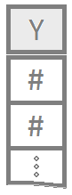

 

----
[Cool Colors](http://www.stat.columbia.edu/~tzheng/files/Rcolor.pdf)

----

<!-- Add your customizations in the area below: -->

**1 Quantitative Variable**

For example, you might:

* write a quick note to tell yourself that the image on the left represents "height" or "weight" data. 

* You may include a link to [dot plots](GraphicalSummaries.html#dot-plots), [histograms](GraphicalSummaries.html#histograms), or [standard deviation](NumericalSummaries.html#standard-deviation). 

* Or, you might highlight some text to show its importance, or just change the text color or text size or even all three.

If you want to learn more about customizing this table of contents, see the "R Help -> R Markdown Hints" page of your Math 325 Notebook.

<!------------------------------------------------>

----

<!-- Add your customizations in the area below: -->

**1 Quantitative Variable | 2 Groups**

Represents two columns that you are looking at such as height and weight and this would allow you would compare.

Y what we are interested in and X is how we try to find Y. 

<!------------------------------------------------>

----

<!-- Add your customizations in the area below: -->

**1 Quantitative Variable | 3+ Groups**

<!------------------------------------------------>

----

<!-- Add your customizations in the area below: -->

**2 Quantitative Variables**

<!------------------------------------------------>

----

<!-- Add your customizations in the area below: -->

**1 Quantitative Response | Multiple Explanatory Variables**

<!------------------------------------------------>

----

<!-- Add your customizations in the area below: -->

**Binomial Response | 1 Explanatory Variable**

<!------------------------------------------------>

----

<!-- Add your customizations in the area below: -->

**Binomial Response | Multiple Explanatory Variables**

<!------------------------------------------------>

----

<!-- Add your customizations in the area below: -->

**2 Qualitative Variables**

You use a bar chart. 

ex: Are men or women more likely to get an A in the class?

<!------------------------------------------------>

----

<footer></footer>

